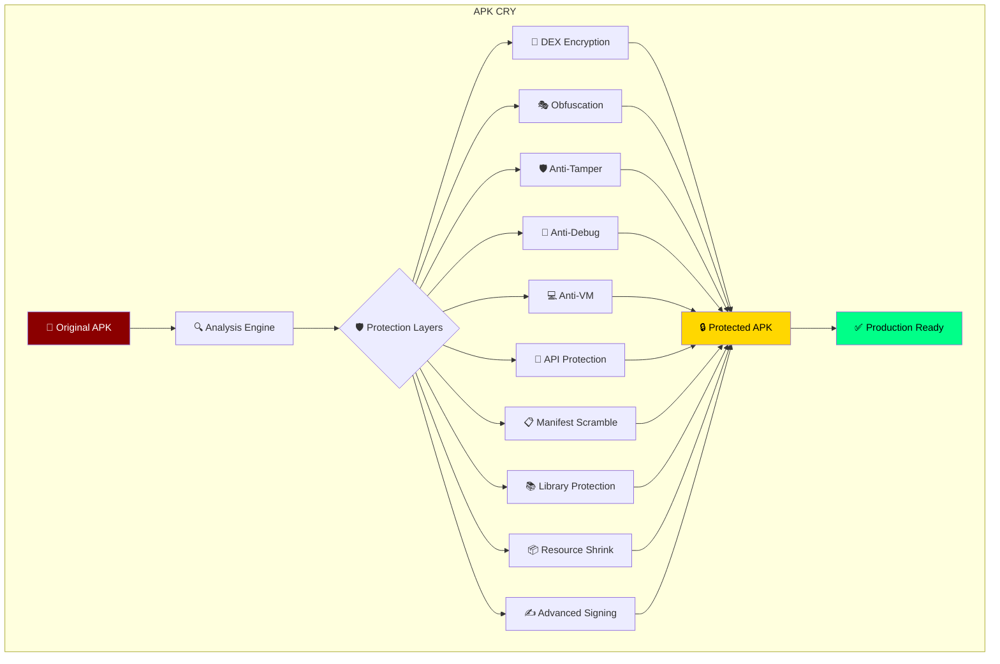
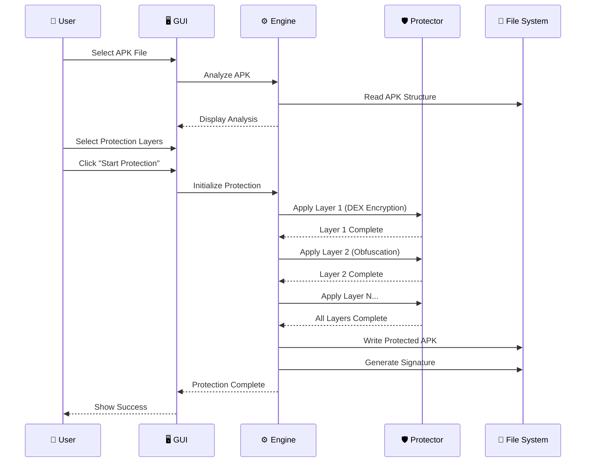
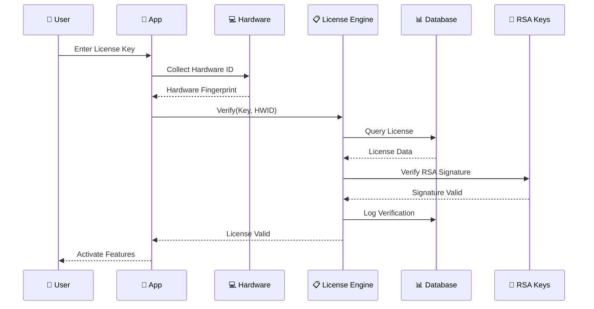
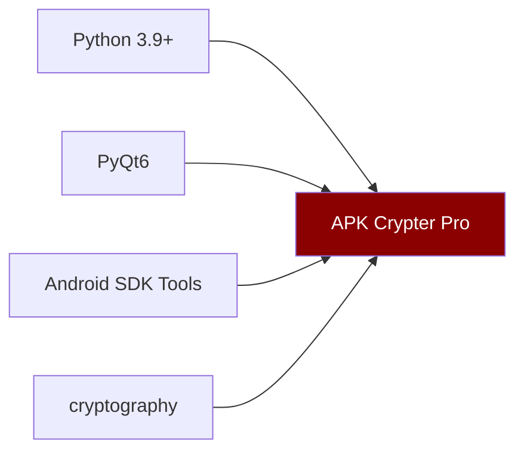
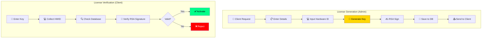

<a href="https://github.com/Athexblackhat/APK-CRY"></a> 
# 🔐 APK CRY


**The Ultimate Military-Grade APK Protection Suite**

*10+ Security Layers | Hardware-Locked Licensing | RSA-4096 Digital Signatures*

[Features](#-features) • [Installation](#-installation) • [Architecture](#-architecture) • [Security](#-security-layers) • [License](#-licensing-system) • [API](#-api-reference) • [FAQ](#-faq)


---

## 📖 Table of Contents

- [Overview](#-overview)
- [Architecture](#-architecture)
- [Features](#-features)
- [Installation](#-installation)
- [Usage](#-usage)
- [Security Layers](#-security-layers)
- [Licensing System](#-licensing-system)
- [Project Structure](#-project-structure)
- [API Reference](#-api-reference)
- [Configuration](#-configuration)
- [FAQ](#-faq)
- [Contributing](#-contributing)
- [Disclaimer](#-disclaimer)
- [License](#-license)

---

## 🎯 Overview

**APK Cry** is an enterprise-grade Android application protection suite designed to secure APK files against reverse engineering, static/dynamic analysis, tampering, and unauthorized access. 

Built with a sophisticated multi-layered security architecture, it employs **10+ protection mechanisms** including DEX encryption, code obfuscation, anti-debugging, anti-VM detection, and hardware-bound licensing with RSA-4096 digital signatures.



## 🏗️ Architecture

mermaid```
graph LR
    subgraph "Frontend Layer"
        GUI[🖥️ PyQt6 GUI]
        CLI[💻 CLI Interface]
        API[REST API]
    end
    
    subgraph "Core Engine"
        AE[🔍 Analysis Engine]
        PE[🛡️ Protection Engine]
        CE[🔐 Crypto Engine]
        LE[📋 License Engine]
    end
    
    subgraph "Security Modules"
        SM1[DEX Encryption]
        SM2[Obfuscation]
        SM3[Anti-Tamper]
        SM4[Anti-Debug]
        SM5[RASP]
    end
    
    subgraph "Data Layer"
        DB[(📊 License DB)]
        FS[📁 File System]
        CFG[⚙️ Config]
    end
    
    GUI --> AE
    GUI --> PE
    CLI --> PE
    API --> LE
    
    AE --> CE
    PE --> SM1
    PE --> SM2
    PE --> SM3
    PE --> SM4
    PE --> SM5
    
    LE --> DB
    PE --> FS
    AE --> CFG
    
    style GUI fill:#9945FF,color:#fff
    style PE fill:#8B0000,color:#fff
    style DB fill:#FFD700,color:#000
    ```

## Protection Flow


## License Verification Flow


## 📥 Installation


## Requirement	Version	Purpose
```
Python	3.9+	Core runtime
PyQt6	6.5+	Professional GUI
cryptography	41.0+	Encryption & RSA
Java JDK	11+	APK signing
Android SDK	Latest	Build tools
```
## Quick Install


git clone https://github.com/Athexblackhat/APK-CRY.git
cd APK-CRY

# Install dependencies
pip install -r requirements.txt

# Run the application
python run.py
Platform-Specific
<details> <summary><strong>🪟 Windows</strong></summary>

## Download standalone executable
## OR install from source:

 1. Install Python 3.9+ from python.org
 2. Install Java JDK 11+
 3. Install Android SDK tools
 4. Run:
pip install -r requirements.txt
Unzip setup.zip
Execute Apk-cry.exe


</details><details> <summary><strong>🐧 Linux</strong></summary>

## Ubuntu/Debian
sudo apt update
sudo apt install python3-pip python3-pyqt6 openjdk-17-jdk android-sdk

## Fedora
sudo dnf install python3-pip python3-pyqt6 java-17-openjdk android-tools

## Arch
sudo pacman -S python-pip python-pyqt6 jdk17-openjdk android-sdk

## Install Python deps
pip install -r requirements.txt

## Run
python apk-cry.py
</details><details> <summary><strong>🍎 macOS</strong></summary>

## Install Homebrew if not installed
/bin/bash -c "$(curl -fsSL https://raw.githubusercontent.com/Homebrew/install/HEAD/install.sh)"

## Install dependencies
brew install python@3.11 openjdk@17 android-sdk

## Install Python packages
pip3 install -r requirements.txt

## Run
python3 apk-cry.py
</details>

# PAID VERSION

## 🔑 Licensing System




## ❓ FAQ
<details> <summary><strong>Q: Is the Free version really free?</strong></summary> Yes! The Community Edition is completely free with basic protection features. No credit card required. </details><details> <summary><strong>Q: Can I upgrade from Free to Pro?</strong></summary> Absolutely! Your settings and configurations are preserved when upgrading. </details><details> <summary><strong>Q: What happens if I change my hardware?</strong></summary> The license allows 2 out of 5 hardware components to change. For major changes, contact support for a license transfer. </details><details> <summary><strong>Q: Is my APK source code safe?</strong></summary> Yes. All processing is done locally on your machine. No data is ever uploaded to any server. </details><details> <summary><strong>Q: Does this work with Android App Bundle (AAB)?</strong></summary> Currently, the tool works with APK files. AAB support is planned for v4.1. </details><details> <summary><strong>Q: Can I use this commercially?</strong></summary> Yes! Enterprise and Platinum plans include commercial usage rights and white-label options. </details>


## 📄 License
```
APK CRY PRO
Copyright © 2026 ATHEX BLACK HAT
All Rights Reserved.

This software is proprietary and confidential.
Unauthorized copying, distribution, or use is strictly prohibited.
```

<div align="center">
🔗 Quick Links
🌐 Website • 📚 Documentation • 💬 Support • 📧 Contact


<sub>© 2026 APK Cry | APK-CRY Protocol. All rights reserved. | Made with ❤️ for the security community</sub>

</div> ```
